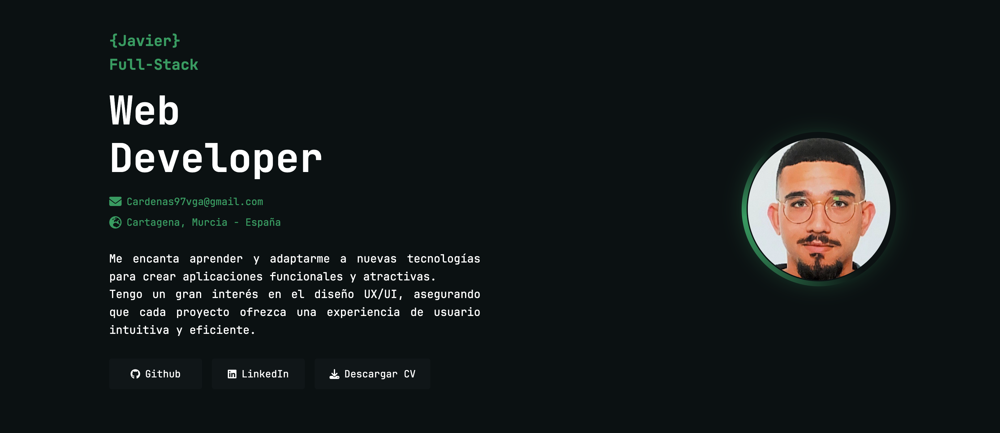

# Bienvenido a [mi Portfolio](https://portfolio-otep.onrender.com/)

¡Hola! Soy Javier, un desarrollador junior apasionado por aprender y mejorar mis habilidades en desarrollo web. Este portfolio está desarrollado con **ASTRO** **HTML** y **CSS**.

## Sobre el Portfolio

Este proyecto es una representación de mis habilidades actuales y mi progreso en el mundo del desarrollo web. Estoy constantemente buscando nuevas oportunidades para aprender y crecer en este campo.

### Inspiración

Este portfolio está inspirado en el trabajo de [Joselu](https://github.com/JoseIu). ¡Muchas gracias por la inspiración!

## Contacto

Si tienes alguna pregunta o sugerencia, no dudes en contactarme:

- **Email:** cardenas97vga@gmail.com
- **GitHub:** [0re0re0](https://github.com/0re0re0)

---

¡Gracias por visitar mi portfolio! Espero que encuentres mi trabajo interesante y que podamos conectar pronto.
